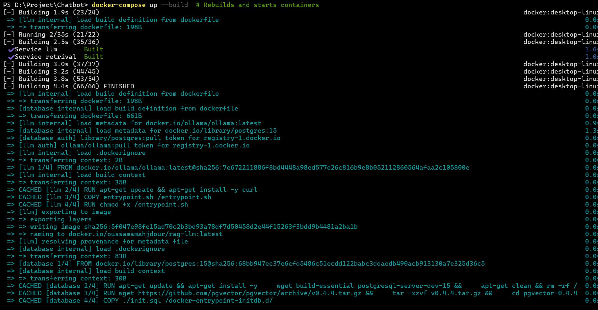
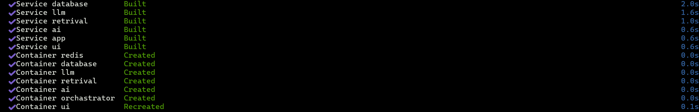
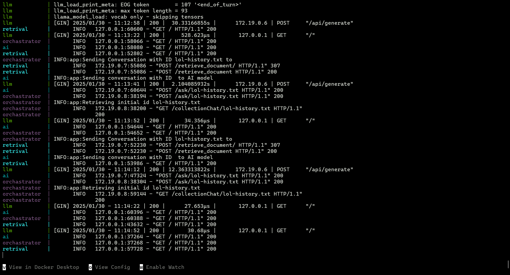
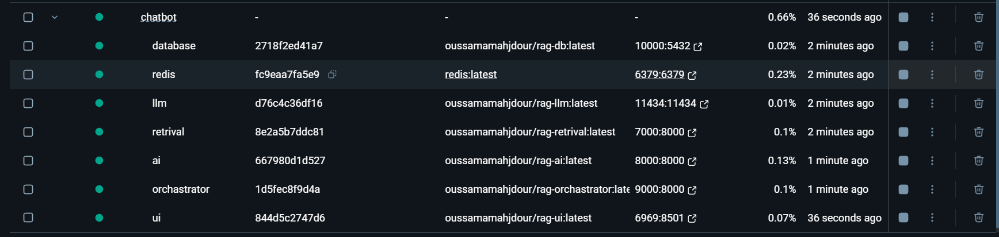
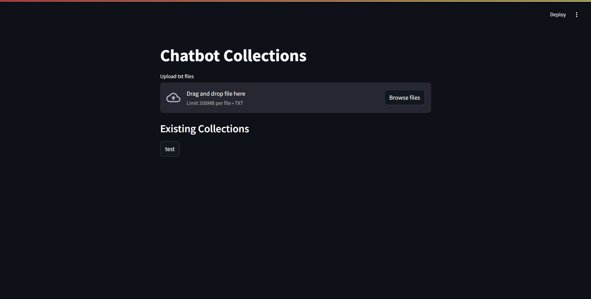
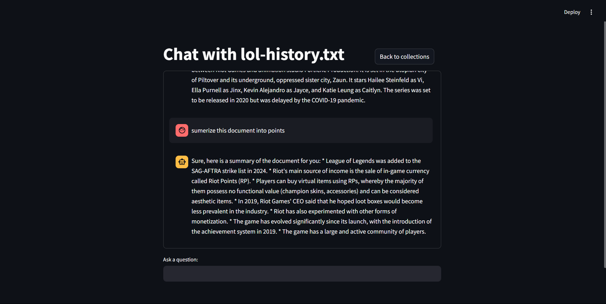
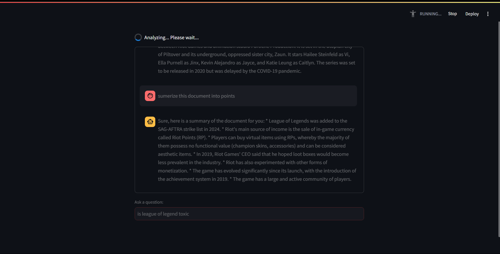
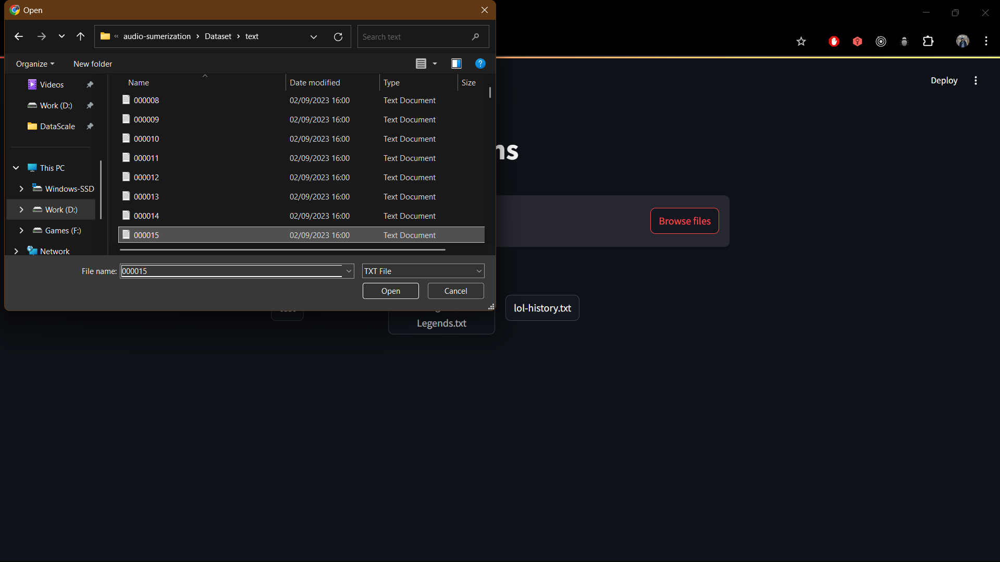
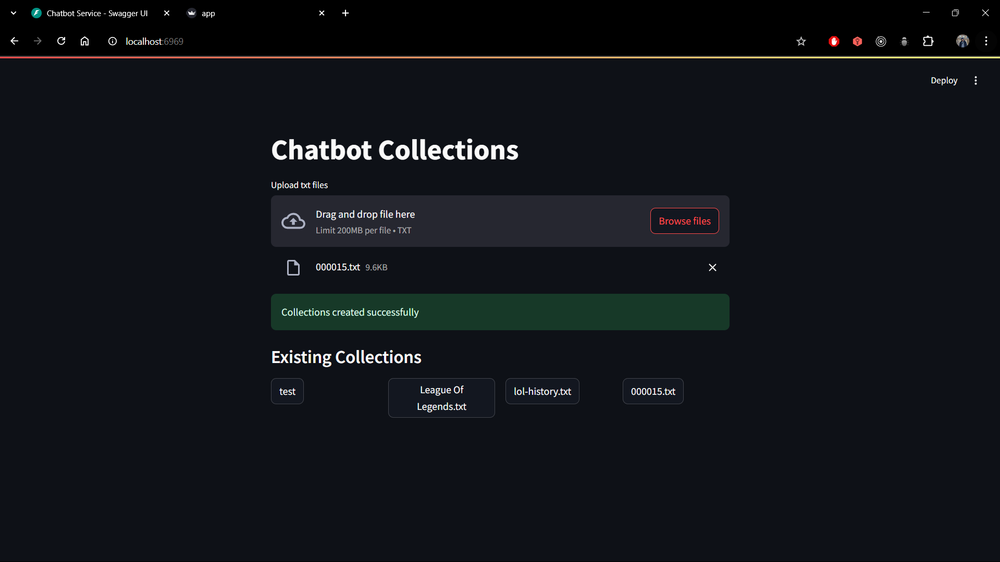
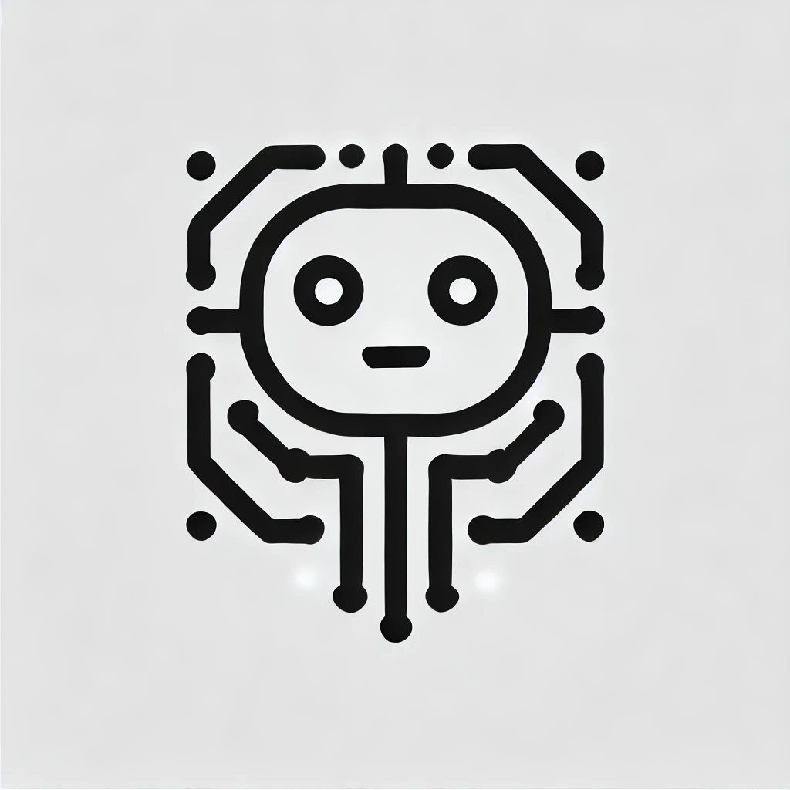

# Chatbot SaaS - Retrieval-Augmented Generation (RAG) Application

A chatbot application leveraging a Retrieval-Augmented Generation (RAG) system, built with a microservices architecture using FastAPI, Docker Compose, and Kubernetes. This project integrates a robust architecture to deliver high-quality, responsive conversational AI.

---

## Architecture Overview


The system is divided into six primary containers to handle distinct responsibilities effectively:

1. **Database Service (Postgres):**

   - Uses PostgreSQL with the pgVector extension for storing vector data, enabling document retrieval and context reuse.

2. **Redis Service:**

   - A short-term database that caches conversations to enhance the chatbot's response quality by maintaining context.

3. **LLM Service:**

   - Hosts the Large Language Model (e.g., Meta's Ollama) to generate responses in-house, reducing reliance on external LLM providers.

4. **Retrieval Service:**

   - Manages text transformation, embedding generation, and document retrieval. Connects with the database to ensure data safety and adds a layer of protection.

5. **AI Service:**

   - Processes queries using relevant documents retrieved by the retrieval service, and communicates with the LLM model to generate final responses.

6. **Orchestrator Service:**

   - Serves as the API gateway, ensuring seamless integration between services and providing clean public-facing endpoints.

7. **UI Service:**
   - A web application enabling users to upload text files and pose questions. Built to provide a user-friendly interface for interacting with the chatbot.

---

## Features

- **Microservices Architecture:** Ensures modularity and scalability.
- **Dockerized Services:** Simplifies deployment and testing across environments.
- **RAG System Integration:** Combines document retrieval with generative AI for contextually accurate responses.
- **LLM Deployment:** Supports in-house LLM hosting for cost-efficiency.
- **Interactive Web UI:** Provides an easy-to-use platform for users to interact with the system.

---

## Setup

To get started with the project:

1. Ensure you have Docker and Docker Compose installed on your system.

2. Clone the repository:

   ```bash
   git clone mahdjourOussama/Chatbot
   cd mahdjourOussama/Chatbot
   ```

3. Start the services using Docker Compose:

   ```bash
   docker-compose up --build
   ```

4. For Kubernetes deployment, apply the configurations:

   ```bash
   kubectl apply -f ./k8s
   ```

---

## Folder Structure

```
./
├── services/
│   ├── orchestrator/
│   ├── ai/
│   ├── retrieval/
│   ├── database/
│   ├── llm/
│   ├── redis/
│   └── ui/
├── k8s/
│   ├── deployment.yml
│   ├── service.yml
├── assets/
│   └── chatbot/
│       └── architecture_diagram.png
└── README.md
└── .env
└── docker-compose.yaml
```

---

## Technologies Used

- **Backend Framework:** FastAPI
- **Frontend Framework:** Streamlit
- **Database:** PostgreSQL with pgVector extension
- **Cache:** Redis
- **Orchestration:** Docker Compose, Kubernetes
- **AI Frameworks:** LangChain, Meta Ollama

---

## Screenshots

Below are some screenshots from the project:

- **Building the images**
  
- **Containers Created**
  
- **Services Logs**
  
- **Docker Desktop**
  
- **Main Application**
  
- **Start Chat with exesting Document**
  
- **Chat interface**
  
- **Chat Loading response**
  
- **Upload Document**
  
- **Document Uploaded**
  

## Demo

Check out our live demo video to see the Chatbot SaaS in action:

[](./assets/demo.mp4)
[](./assets/demo-2.mp4)

Click the image above to watch the demo video.

---

For questions or support, please reach out via [LinkedIn](https://www.linkedin.com/in/oussamamahdjour/)
